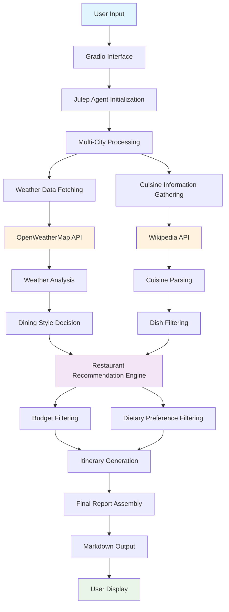

# 🍽️ Personalized Dining Advisor

> An AI-powered dining recommendation system that combines weather data, local cuisine information, and personal preferences to create customized food experiences across multiple cities.

[](https://www.python.org/downloads/)
[](https://gradio.app/)
[](https://julep.ai/)
[](LICENSE)

## 🌟 Overview

The Personalized Dining Advisor is an intelligent application that leverages Julep's Excellent agent-based AI workflows to createto provide tailored dining recommendations based on real-time weather conditions, local cuisine specialties, budget constraints, and dietary preferences. Whether you're planning a food tour across multiple cities or looking for the perfect restaurant for today's weather, this has you covered.

## 🤖 Powered by Julep AI

This application is built using [Julep AI](https://github.com/julep-ai/julep), an open-source platform for orchestrating multi-agent AI workflows.

- **GitHub Repository**: [julep-ai/julep](https://github.com/julep-ai/julep)
- **Documentation**: [docs.julep.ai](https://docs.julep.ai/)
- **Official Website**: [julep.ai](https://julep.ai/)

## 🎥 Demo Video

[](https://drive.google.com/file/d/1zNUNB9SHz8lWA0_fupkXGz_q70vOTirO/view?usp=sharing)

*Click the badge above to watch the full demo video showcasing all features of the Personalized Dining Advisor.*
<p align="center">
  
</p>

## ✨ Features

### 🌍 Multi-City Support
- **Global Coverage**: Support for major cities including Pune, Mumbai, New York, London, Tokyo, Paris, Rome, and San Francisco
- **Simultaneous Planning**: Plan dining experiences across multiple cities in one go
- **Real-time Data**: Live weather and cuisine information for each selected city

### 🌤️ Weather-Aware Recommendations
- **Indoor/Outdoor Dining**: Intelligent suggestions based on current weather conditions
- **Seasonal Adaptability**: Recommendations adapt to temperature, precipitation, and wind conditions
- **Comfort Optimization**: Ensures optimal dining comfort based on environmental factors

### 🍜 Cuisine Intelligence
- **Traditional Dishes**: Discover authentic local specialties for each city
- **Dietary Filtering**: Vegetarian, non-vegetarian, and omnivore options
- **Cultural Authenticity**: Recommendations based on Wikipedia's extensive cuisine database

### 💰 Budget-Conscious Planning
- **Flexible Budgets**: Low, Moderate, and High budget categories
- **Value Optimization**: Best restaurants matching your budget range
- **Transparent Pricing**: Clear budget alignment for all recommendations

### 🗓️ Personalized Itineraries
- **One-Day Food Tours**: Complete breakfast, lunch, and dinner plans
- **Restaurant Pairing**: 2 restaurant options for each recommended dish
- **Time-Optimized**: Efficient routing for food exploration

## 🔧 Installation

### Prerequisites
- Python 3.7 or higher
- Julep API Key ([Get it here](https://julep.ai/))
- OpenWeatherMap API Key ([Get it here](https://openweathermap.org/api))

### Quick Start

1. **Clone the repository**
   ```bash
   git clone https://github.com/yourusername/personalized-dining-advisor.git
   cd personalized-dining-advisor
   ```

2. **Install dependencies**
   ```bash
   pip install gradio python-dotenv julep pyyaml -U
   ```

3. **Run the application**
   ```bash
   python dining_advisor.py
   ```

4. **Enter your API keys when prompted**
   - Julep API Key
   - OpenWeatherMap API Key

5. **Access the web interface**
   - Open the provided local URL in your browser
   - Use the public URL for sharing (if using Colab)

## 🏗️ Architecture & Workflow



## 📊 System Components

### 🤖 AI Agent Architecture
- **Julep Framework**: Orchestrates the entire recommendation pipeline
- **GPT-4 Integration**: Powers intelligent decision-making and content generation
- **Multi-tool Coordination**: Seamlessly integrates weather and cuisine data sources

### 🌐 External Integrations
- **OpenWeatherMap**: Real-time weather data with forecasting
- **Wikipedia**: Comprehensive cuisine and cultural information [ as i was not able to get brave web API key due to card issue 
- **Gradio**: Interactive web interface with real-time updates

### 🎨 User Interface
- **Responsive Design**: Works across desktop and mobile devices
- **Progress Tracking**: Real-time feedback during processing
- **Interactive Controls**: Intuitive checkboxes, radio buttons, and text inputs

## 🚀 Usage Guide

### Step 1: Select Cities
Choose one or more cities from the available options:
- **Pune** - Indian cuisine hub
- **Mumbai** - Bollywood food scene
- **New York** - Melting pot of flavors
- **London** - Traditional British with international flair
- **Tokyo** - Authentic Japanese cuisine
- **Paris** - French culinary excellence
- **Rome** - Italian food paradise
- **San Francisco** - Innovative fusion cuisine

### Step 2: Set Parameters
- **Date**: Specify the date for your dining experience (format: YYYY-MM-DD)
- **Budget**: Choose from Low, Moderate, or High
- **Dietary Preference**: Select Any, Vegetarian, or Non-Vegetarian

### Step 3: Get Recommendations
Click "Get Personalized Advice" and watch as the AI agent:
1. Fetches real-time weather data
2. Gathers cuisine information
3. Analyzes preferences and constraints
4. Generates personalized recommendations
5. Creates a complete itinerary

### Step 4: Explore Results
Review your customized report featuring:
- Weather-appropriate dining styles
- Traditional dish recommendations
- Restaurant pairings with budget alignment
- Complete one-day food tour itinerary

## 🛠️ Technical Implementation

### Core Technologies
- **Python 3.7+**: Primary programming language
- **Gradio**: Web interface framework
- **Julep**: AI agent orchestration platform
- **YAML**: Configuration and task definition
- **OpenWeatherMap API**: Weather data source
- **Wikipedia API**: Cuisine information source

### Key Features Implementation

#### Weather-Based Decisions
```python
# Indoor conditions: rain/snow/wind>8m/s/temp<10°C or >35°C
# Outdoor conditions: clear/calm/temp 15–30°C
```

#### Dietary Filtering
```python
# 'Any': Mixed recommendations
# 'Veg': Vegetarian dishes only
# 'Non-Veg': Meat/fish prioritized
```

#### Budget Alignment
```python
# Low: Budget-friendly options
# Moderate: Mid-range establishments
# High: Premium dining experiences
```


## 📄 License

This project is licensed under the MIT License - see the [LICENSE](LICENSE) file for details.

## 🙏 Acknowledgments

- **Julep Team** for the amazing AI agent framework
- **OpenWeatherMap** for reliable weather data
- **Wikipedia** for comprehensive cuisine information
- **Gradio Team** for the intuitive interface framework
- **Open Source Community** for continuous inspiration and support

## 📞 Support

Having issues or questions? I am  here to help!

- 📧 **Email**: pranavdaware1.1@gmail.com
-


---

<div align="center">

**Made with ❤️ by the Pranav Daware**

[⭐ Star us on GitHub](https://github.com/yourusername/personalized-dining-advisor) | [🍴 Fork](https://github.com/yourusername/personalized-dining-advisor/fork) | [📖 Docs](https://docs.dining-advisor.com)

</div>
